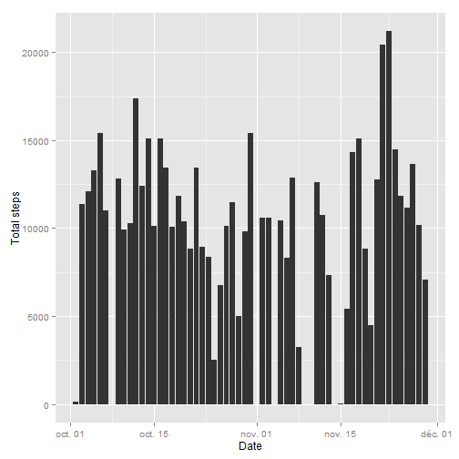
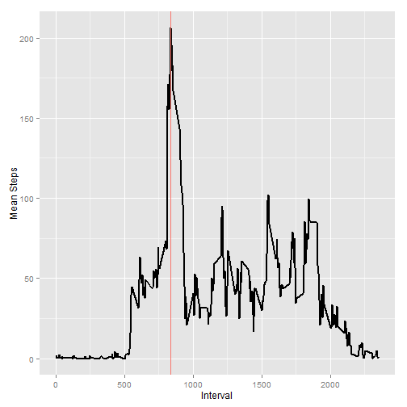
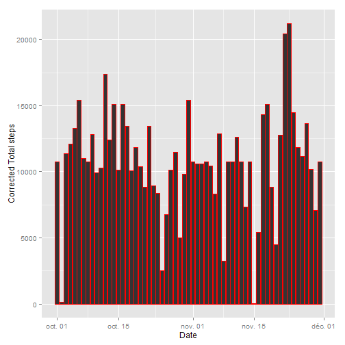
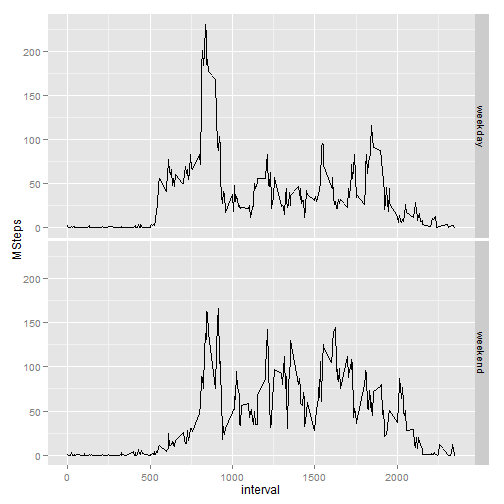

Reproducible Research: Peer Assessment 1
========================================


We first remove all the previous figures and clear the working environment


```r
rm(list = ls())
graphics.off()
```

We then set the working directory and call the necessary packages


```r
setwd("C:/Users/Teardrop/Documents/GitHub/RepData_PeerAssessment1")
library(plyr)
library(ggplot2)
```


## Loading and preprocessing the data

First the data must be read


```r
RawData <- read.csv("activity.csv", header = TRUE, sep = ",", as.is = TRUE)
head(RawData)
```

```
##   steps       date interval
## 1    NA 2012-10-01        0
## 2    NA 2012-10-01        5
## 3    NA 2012-10-01       10
## 4    NA 2012-10-01       15
## 5    NA 2012-10-01       20
## 6    NA 2012-10-01       25
```

Then, the format of the date is established
 

```r
RawData$date <- strptime(RawData$date,  "%Y-%m-%d")
```


## What is mean total number of steps taken per day?

### Total number of steps taken each day

We use the package ddply to calculate the total steps for each day


```r
SummarySteps <- ddply(RawData, .(date), summarise, 
                      TSteps = sum(steps))
p <- ggplot(data = SummarySteps, aes(x = date, y = TSteps))
p <- p + geom_bar(stat = "identity") + xlab("Date") + ylab("Total steps")
p
```

```
## Warning: Removed 8 rows containing missing values (position_stack).
```

 

###  Mean and median total number of steps taken per day


```r
MeanSteps <- mean(SummarySteps$TSteps, na.rm = TRUE)
MedSteps <- median(SummarySteps$TSteps, na.rm = TRUE)
```

Mean total number of steps taken per day


```r
print(MeanSteps)
```

```
## [1] 10766
```

Mean total number of steps taken per day


```r
print(MedSteps)
```

```
## [1] 10765
```


## What is the average daily activity pattern?


The next figure shows a time series plot of the 5-minute interval and the average number of steps taken, averaged across all days. The red line represents the interval where the maximum average number of steps occurs.


```r
SummaryStepsInt <- ddply(RawData, .(interval), summarise, 
                      MSteps = mean(steps, na.rm = TRUE))

IndMax <- which(SummaryStepsInt$MSteps == max(SummaryStepsInt$MSteps, na.rm = TRUE))

yline <- SummaryStepsInt$interval[IndMax]

p2 <- ggplot(data = SummaryStepsInt, aes(x = interval, y = MSteps))
p2 + geom_line(size=1) + geom_vline(aes(xintercept=yline, colour="#BB0000", linetype="dashed")) + xlab("Interval") + ylab("Mean Steps")
```

 


## Imputing missing values

The total number of missing values is 


```r
IndNA <- is.na(RawData$steps)
TotalNA <- sum(IndNA)

print(TotalNA)
```

```
## [1] 2304
```


And to replace the missing values with the mean steps by interval:
 
 a. We first match the intervals with missing data with the intervals of the summary to obtain the index of the mean steps by interval
 
 a. We then use the index to access the mean steps by interval from the summary and we use it to replace the missing values
 
 


```r
TidyData <- RawData

IndReplaceNA <- match(RawData$interval[IndNA],SummaryStepsInt$interval)

TidyData$steps[IndNA] <- SummaryStepsInt$MSteps[IndReplaceNA]
```


Which yields


```r
head(TidyData)
```

```
##     steps       date interval
## 1 1.71698 2012-10-01        0
## 2 0.33962 2012-10-01        5
## 3 0.13208 2012-10-01       10
## 4 0.15094 2012-10-01       15
## 5 0.07547 2012-10-01       20
## 6 2.09434 2012-10-01       25
```


### Total number of steps taken each day

A histogram of the total number of steps taken each day is


```r
SummarySteps2 <- ddply(TidyData, .(date), summarise, 
                      TSteps = sum(steps))
p3 <- ggplot(data = SummarySteps2, aes(x = date, y = TSteps))
p3 <- p3 + geom_bar(stat = "identity", colour = "red") 
p3 <- p3 + xlab("Date") + ylab("Corrected Total steps")
p3
```

 

Compared with the old calculated values:


```r
p
```

```
## Warning: Removed 8 rows containing missing values (position_stack).
```

 


###  Corrected Mean and median total number of steps taken per day

Imputing missing values with mean steps taken per interval does not seem to cause a huge difference on the calculations of the mean and median steps taken per day:


```r
MeanSteps2 <- mean(SummarySteps2$TSteps, na.rm = FALSE)
MedSteps2 <- median(SummarySteps2$TSteps, na.rm = FALSE)
```

Corrected Mean total number of steps taken per day does not differ from the previously calculated value


```r
print(MeanSteps2)
```

```
## [1] 10766
```

And the corrected Mean total number of steps taken per day slightly differs from the previously calculated value


```r
print(MedSteps2)
```

```
## [1] 10766
```


# Are there differences in activity patterns between weekdays and weekends?

First, on the data set with the filled-in missing values we create a new column containing the day on which the observation has been taken


```r
TidyData$Day <- weekdays(TidyData$date)
```

Then we define Saturday and Friday as weekend days, 


```r
TidyData$DayF <-apply(as.array(TidyData$Day), 1, function(x) ifelse(x == "samedi" | x == "dimanche", "weekend", "weekday"))
```

And we define it as a factor


```r
TidyData$DayF <- as.factor(TidyData$DayF)
```


We then proceed to evaluate the mean steps taken by the time interval for each factor (*weekday* or *weekend*)


```r
SummaryStepsInt2 <- ddply(TidyData, .(interval, DayF), summarise, 
                      MSteps = mean(steps))
```

And finally we construct the panel plot containing a time series plot of the 5-minute interval and the average number of steps taken, averaged across all weekday days or weekend days.


```r
p4 <- ggplot(data = SummaryStepsInt2, aes(x = interval, y = MSteps)) 
p4 <- p4 + geom_line()
p4 <- p4 + facet_grid(DayF ~.)
p4
```

 
